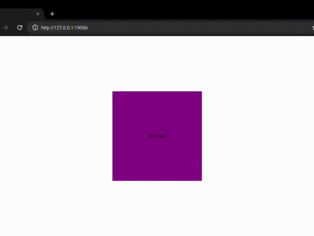

# Swipeable Cards for React Native
- swipe-left-for-next;swipe-right-for-previous kind of cards deck/stack similar to the Flutter package [ninest/swipeable_card](https://github.com/ninest/swipeable_card).
- 
- Note that this package is just a mod of [swaplet/react-native-swipe-cards-deck](https://github.com/swaplet/react-native-swipe-cards-deck) in the main.

## Quick Start
1. `npm i react-native-swipeable-card-deck`
2. Import it `import SwipeCards from "react-native-swipeable-card-deck"`
3. Render it `<SwipeCards ... />`

```javascript
import React, { useEffect, useState } from "react";
import { StyleSheet, Text, View } from "react-native";
import SwipeCards from "react-native-swipeable-card-deck";

function Card({ data }) {
  return (
    <View style={[styles.card, { backgroundColor: data.backgroundColor }]}>
      <Text>{data.text}</Text>
    </View>
  );
}

function StatusCard({ text }) {
  return (
    <View>
      <Text style={styles.cardsText}>{text}</Text>
    </View>
  );
}

export default function App() {
  const [cards, setCards] = useState();

  // replace with real remote data fetching
  useEffect(() => {
    setTimeout(() => {
      setCards([
        { text: "1st card", backgroundColor: "red" },
        { text: "2nd card", backgroundColor: "purple" },
        { text: "3rd card", backgroundColor: "green" },
        { text: "4th card", backgroundColor: "blue" },
        { text: "5th card", backgroundColor: "cyan" },
        { text: "Last card", backgroundColor: "orange" },
      ]);
    }, 3000);
  }, []);

  function handleLeft() {
    console.log(`Next`);
    return true;
  }
  
  function handleRight() {
    console.log(`Previous`);
    return true; // return false if you wish to cancel the action
  }
  
  function handleUp() {
    console.log(`UP`);
    return true;
  }

  return (
    <View style={styles.container}>
      {cards ? (
        <SwipeCards
          cards={cards}
          renderCard={(cardData) => <Card data={cardData} />}
          keyExtractor={(cardData) => String(cardData.text)}
          renderNoMoreCards={() => <StatusCard text="No more cards..." />}
          actions={{
            left: { /*show:false,*/ onAction: handleLeft },
            right: { /*show:false,*/ onAction: handleRight },
            up: { /*show:false,*/ onAction: handleUp },
          }}
          hasUpAction={true}

          // If you want a stack of cards instead of one-per-one view, activate stack mode
          // stack={true}
          // stackDepth={3}
        />
      ) : (
        <StatusCard text="Loading..." />
      )}
    </View>
  );
}

const styles = StyleSheet.create({
  container: {
    flex: 1,
    backgroundColor: "#fff",
    alignItems: "center",
    justifyContent: "center",
  },
  card: {
    justifyContent: "center",
    alignItems: "center",
    width: 300,
    height: 300,
  },
  cardsText: {
    fontSize: 22,
  },
});
```
